# Authentication UI Architecture - TripPlanner

<architecture_analysis>

## 1. Relevant Elements

### Domain Concepts

- **User**: Core entity with branded UserId, email, name, avatar, emailVerified
- **Session**: Holds session tokens and expiration
- **AuthUser**: Client-side user representation for Zustand store

### Domain Errors

- **AuthenticationError**: Invalid credentials, session expired
- **RegistrationError**: Email already exists, weak password
- **PasswordResetError**: Invalid/expired token

### Handlers/Routes

- `POST /api/auth/login` - Email/password authentication
- `POST /api/auth/signup` - User registration
- `POST /api/auth/logout` - Session termination
- `GET /api/auth/google` - OAuth initiation (server-side PKCE)
- `GET /api/auth/callback` - OAuth code exchange
- `POST /api/auth/reset-password` - Password reset request
- `POST /api/auth/update-password` - New password submission
- `POST /api/auth/resend-verification` - Resend email verification

### UI Components

- `LoginForm` - Email/password login with validation
- `SignupForm` - Registration with password strength
- `ResetPasswordForm` - Password reset request
- `UpdatePasswordForm` - New password entry
- `GoogleOAuthButton` - OAuth initiation
- `EmailVerificationBanner` - Verification status
- `UserMenuDropdown/Drawer` - Authenticated user menu
- `AuthLayout` - Shared layout wrapper

### State Management

- **Zustand authStore**: Client-side state (user, isAuthenticated, emailVerificationDismissed)
- Partial persistence via sessionStorage

## 2. Main Stages

### Authentication Flows

1. **Login**: Form → Validate → API → Supabase Auth → Cookies → Redirect
2. **Signup**: Form → Validate → API → Supabase Auth → Email verification → Auto-login
3. **OAuth**: Button → Server API (PKCE) → Google → Supabase → Callback → Code exchange → Cookies
4. **Logout**: Button → Store action → API → Clear cookies → Redirect
5. **Password Reset**: Request form → API → Email → Click link → Update form → API

### Middleware Processing

1. Every request → Create Supabase client → Validate session with getUser()
2. Set locals.user if authenticated
3. Route protection based on public/protected paths

## 3. Data & Event Flow

### Synchronous Flows

- Form submission → API route → Supabase Auth → Response
- Middleware validation → Every request

### Asynchronous/External

- Email sending (Supabase handles)
- OAuth redirect to Google

### Data Passed

- Forms: email, password, confirmPassword
- API responses: success, user, error
- Middleware: locals.user, locals.supabase
- Cookies: httpOnly session tokens

## 4. Component Descriptions

| Component          | Description                                        |
| ------------------ | -------------------------------------------------- |
| AuthLayout         | Centered card wrapper for all auth pages           |
| LoginForm          | Email/password form with Zod validation            |
| SignupForm         | Registration form with password strength indicator |
| GoogleOAuthButton  | Redirects to server OAuth endpoint                 |
| /api/auth/google   | Server-side OAuth initiation with PKCE             |
| ResetPasswordForm  | Email input for password reset request             |
| UpdatePasswordForm | New password entry after email link click          |
| UserMenuDropdown   | Desktop authenticated user menu                    |
| authStore          | Zustand store synced with server state             |
| Middleware         | Route protection and session validation            |
| supabase-server    | Server Supabase client with cookie handling        |

```mermaid
flowchart TB
    %% ========================================
    %% STYLING
    %% ========================================
    classDef userActor fill:#e1f5fe,stroke:#0288d1,stroke-width:2px,color:#01579b
    classDef page fill:#fff3e0,stroke:#f57c00,stroke-width:2px,color:#e65100
    classDef component fill:#e8f5e9,stroke:#43a047,stroke-width:2px,color:#1b5e20
    classDef api fill:#fce4ec,stroke:#d81b60,stroke-width:2px,color:#880e4f
    classDef middleware fill:#f3e5f5,stroke:#8e24aa,stroke-width:2px,color:#4a148c
    classDef infrastructure fill:#e3f2fd,stroke:#1976d2,stroke-width:2px,color:#0d47a1
    classDef external fill:#fff8e1,stroke:#ffa000,stroke-width:3px,color:#ff6f00
    classDef domain fill:#efebe9,stroke:#6d4c41,stroke-width:2px,color:#3e2723
    classDef store fill:#f1f8e9,stroke:#689f38,stroke-width:2px,color:#33691e
    classDef decision fill:#ffebee,stroke:#c62828,stroke-width:2px,color:#b71c1c

    %% ========================================
    %% ACTORS
    %% ========================================
    subgraph Actors["👤 Actors"]
        User([User]):::userActor
    end

    %% ========================================
    %% PRESENTATION LAYER
    %% ========================================
    subgraph Presentation["🖥️ Presentation Layer"]
        direction TB

        subgraph AstroPages["Astro Pages"]
            LoginPage["/login.astro"]:::page
            SignupPage["/signup.astro"]:::page
            ResetPage["/reset-password.astro"]:::page
            UpdatePage["/update-password.astro"]:::page
            VerifyPage["/verify-email.astro"]:::page
            CallbackPage["/auth/callback.astro"]:::page
        end

        subgraph ReactForms["React Form Components"]
            LoginForm["LoginForm
            • Email/Password inputs
            • Zod validation
            • Error display"]:::component
            SignupForm["SignupForm
            • Email/Password/Confirm
            • Password strength
            • Zod validation"]:::component
            ResetForm["ResetPasswordForm
            • Email input
            • Success state"]:::component
            UpdateForm["UpdatePasswordForm
            • New password
            • Confirm password"]:::component
            GoogleBtn["GoogleOAuthButton
            • Redirect to /api/auth/google
            • Loading state"]:::component
            VerifyBanner["EmailVerificationBanner
            • Resend link
            • Dismiss action"]:::component
        end

        subgraph UserMenu["User Menu Components"]
            MenuDropdown["UserMenuDropdown
            • Desktop dropdown
            • User info display"]:::component
            MenuDrawer["UserMenuDrawer
            • Mobile drawer
            • Logout action"]:::component
        end

        subgraph LayoutComponents["Layout Components"]
            AuthLayout["AuthLayout
            • Centered card
            • Title/Description"]:::component
            FormInput["AuthFormInput
            • Styled input
            • Error display"]:::component
            PasswordStrength["PasswordStrengthIndicator
            • Visual meter"]:::component
        end
    end

    %% ========================================
    %% CLIENT STATE
    %% ========================================
    subgraph ClientState["📦 Client State"]
        AuthStore["authStore (Zustand)
        ─────────────────
        State:
        • user: AuthUser | null
        • isAuthenticated: boolean
        • emailVerificationDismissed
        ─────────────────
        Actions:
        • setUser()
        • logout()
        • dismissEmailVerification()"]:::store

        SessionStorage[("sessionStorage
        • emailVerificationDismissed only
        • User data from server")]:::store
    end

    %% ========================================
    %% API LAYER
    %% ========================================
    subgraph APILayer["🔌 API Layer (Astro Routes)"]
        direction TB
        LoginAPI["POST /api/auth/login
        • Validate with Zod
        • Call Supabase signIn
        • Return user/error"]:::api

        SignupAPI["POST /api/auth/signup
        • Validate with Zod
        • Call Supabase signUp
        • Return user/error"]:::api

        LogoutAPI["POST /api/auth/logout
        • Call Supabase signOut
        • Clear cookies"]:::api

        GoogleAPI["GET /api/auth/google
        • Server-side OAuth init
        • PKCE verifier in cookie
        • Redirect to Google"]:::api

        CallbackAPI["GET /api/auth/callback
        • Extract code param
        • PKCE verifier from cookie
        • Exchange for session"]:::api

        ResetAPI["POST /api/auth/reset-password
        • Validate email
        • Send reset email
        • Always return success"]:::api

        UpdateAPI["POST /api/auth/update-password
        • Validate passwords
        • Update via Supabase
        • Handle token errors"]:::api

        ResendAPI["POST /api/auth/resend-verification
        • Resend verification email"]:::api
    end

    %% ========================================
    %% MIDDLEWARE LAYER
    %% ========================================
    subgraph MiddlewareLayer["🛡️ Middleware Layer"]
        Middleware["onRequest Middleware
        ══════════════════════
        1. Create Supabase client
        2. Call getUser() (NOT getSession!)
        3. Set locals.user if authenticated
        4. Route protection logic"]:::middleware

        PublicPaths{"Public Path?
        /, /login, /signup,
        /reset-password, etc."}:::decision

        AuthCheck{"User
        Authenticated?"}:::decision
    end

    %% ========================================
    %% INFRASTRUCTURE LAYER
    %% ========================================
    subgraph Infrastructure["⚙️ Infrastructure Layer"]
        direction TB

        subgraph SupabaseServer["Supabase Server Client"]
            ServerClient["createSupabaseServerInstance()
            • httpOnly cookies
            • getAll/setAll only
            • Secure cookie options"]:::infrastructure
        end

        subgraph Validation["API Contracts"]
            Schemas["Zod Schemas
            • LoginCommandSchema
            • SignupCommandSchema
            • ResetPasswordCommandSchema
            • UpdatePasswordCommandSchema"]:::infrastructure

            Mappers["DTO Mappers
            • toDomain functions"]:::infrastructure
        end
    end

    %% ========================================
    %% DOMAIN LAYER
    %% ========================================
    subgraph DomainLayer["📋 Domain Layer"]
        direction TB

        subgraph Models["Models"]
            UserModel["User
            • UserId (branded)
            • email, name, avatar
            • emailVerified"]:::domain

            SessionModel["Session
            • accessToken
            • refreshToken
            • expiresAt"]:::domain
        end

        subgraph Errors["Domain Errors"]
            AuthError["AuthenticationError
            • invalidCredentials()
            • sessionExpired()"]:::domain

            RegError["RegistrationError
            • emailAlreadyExists()
            • weakPassword()"]:::domain

            PwdError["PasswordResetError
            • invalidToken()
            • expiredToken()"]:::domain
        end
    end

    %% ========================================
    %% EXTERNAL SERVICES
    %% ========================================
    subgraph External["☁️ External Services"]
        SupabaseAuth[("Supabase Auth
        • User management
        • Session handling
        • Email sending")]:::external

        GoogleOAuth[("Google OAuth
        • Identity provider
        • Token exchange")]:::external

        Browser[("Browser
        • Cookies storage
        • Session storage")]:::external
    end

    %% ========================================
    %% CONNECTIONS - User Interactions
    %% ========================================
    User -->|"Navigate"| LoginPage
    User -->|"Navigate"| SignupPage
    User -->|"Navigate"| ResetPage
    User -->|"Click reset link"| UpdatePage
    User -->|"OAuth callback"| CallbackPage

    %% ========================================
    %% CONNECTIONS - Page to Component
    %% ========================================
    LoginPage --> LoginForm
    LoginPage --> GoogleBtn
    SignupPage --> SignupForm
    SignupPage --> GoogleBtn
    ResetPage --> ResetForm
    UpdatePage --> UpdateForm

    LoginForm --> AuthLayout
    SignupForm --> AuthLayout
    ResetForm --> AuthLayout
    UpdateForm --> AuthLayout

    AuthLayout --> FormInput
    SignupForm --> PasswordStrength
    UpdateForm --> PasswordStrength

    %% ========================================
    %% CONNECTIONS - Form Submissions
    %% ========================================
    LoginForm -->|"POST credentials"| LoginAPI
    SignupForm -->|"POST registration"| SignupAPI
    ResetForm -->|"POST email"| ResetAPI
    UpdateForm -->|"POST new password"| UpdateAPI
    VerifyBanner -->|"POST resend"| ResendAPI

    %% ========================================
    %% CONNECTIONS - OAuth Flow (Server-Side PKCE)
    %% ========================================
    GoogleBtn -->|"1. Redirect"| GoogleAPI
    GoogleAPI -->|"2. signInWithOAuth + PKCE"| ServerClient
    ServerClient -->|"3. OAuth URL"| GoogleAPI
    GoogleAPI -->|"4. Redirect to Google"| GoogleOAuth
    GoogleOAuth -->|"5. Redirect to Supabase"| SupabaseAuth
    SupabaseAuth -->|"6. Redirect with code"| CallbackAPI
    CallbackAPI -->|"7. exchangeCodeForSession"| ServerClient

    %% ========================================
    %% CONNECTIONS - Logout
    %% ========================================
    MenuDropdown -->|"Click logout"| AuthStore
    MenuDrawer -->|"Click logout"| AuthStore
    AuthStore -->|"POST"| LogoutAPI
    LogoutAPI -->|"signOut"| SupabaseAuth

    %% ========================================
    %% CONNECTIONS - API to Infrastructure
    %% ========================================
    LoginAPI --> Schemas
    SignupAPI --> Schemas
    ResetAPI --> Schemas
    UpdateAPI --> Schemas

    LoginAPI --> ServerClient
    SignupAPI --> ServerClient
    LogoutAPI --> ServerClient
    GoogleAPI --> ServerClient
    CallbackAPI --> ServerClient
    ResetAPI --> ServerClient
    UpdateAPI --> ServerClient

    ServerClient -->|"Auth operations"| SupabaseAuth

    %% ========================================
    %% CONNECTIONS - Error Handling
    %% ========================================
    LoginAPI -.->|"Error response"| AuthError
    SignupAPI -.->|"Error response"| RegError
    UpdateAPI -.->|"Error response"| PwdError

    %% ========================================
    %% CONNECTIONS - Middleware Flow
    %% ========================================
    Browser -->|"Every request"| Middleware
    Middleware --> ServerClient
    Middleware --> PublicPaths
    PublicPaths -->|"Yes"| AuthCheck
    PublicPaths -->|"No (protected)"| AuthCheck
    AuthCheck -->|"No + Protected"| LoginPage
    AuthCheck -->|"Yes + /login"| User

    %% ========================================
    %% CONNECTIONS - State Management
    %% ========================================
    LoginAPI -->|"Success response"| Browser
    SignupAPI -->|"Success response"| Browser
    Browser -->|"Page load"| AuthStore
    AuthStore <-->|"Persist dismissal"| SessionStorage
    Middleware -->|"locals.user"| AstroPages
    AstroPages -->|"Props"| AuthStore

    %% ========================================
    %% CONNECTIONS - Cookie Flow
    %% ========================================
    SupabaseAuth -->|"Session cookies"| ServerClient
    ServerClient -->|"setAll cookies"| Browser
```

</architecture_analysis>

<mermaid_diagram>

</mermaid_diagram>

## Diagram Legend

| Symbol             | Meaning             |
| ------------------ | ------------------- |
| 👤 Blue oval       | User/Actor          |
| 🟠 Orange box      | Astro Page          |
| 🟢 Green box       | React Component     |
| 🔴 Pink box        | API Route           |
| 🟣 Purple box      | Middleware          |
| 🔵 Blue box        | Infrastructure      |
| 🟤 Brown box       | Domain Layer        |
| 🟡 Yellow cylinder | External Service    |
| ◇ Diamond          | Decision Point      |
| → Solid arrow      | Synchronous flow    |
| ⇢ Dashed arrow     | Error/optional flow |

## Flow Summary

### Email/Password Login

1. User navigates to `/login`
2. `LoginForm` validates input with Zod schema
3. Form submits to `POST /api/auth/login`
4. API validates → Supabase `signInWithPassword`
5. Cookies set via `setAll` callback
6. Browser redirects, middleware validates session
7. `locals.user` populated, passed to components via props

### Google OAuth (Server-Side PKCE)

1. User clicks `GoogleOAuthButton`
2. Browser redirects to `/api/auth/google`
3. Server initiates OAuth via Supabase (PKCE verifier stored in cookie)
4. Browser redirects to Google consent page
5. Google redirects to Supabase Auth
6. Supabase redirects to `/api/auth/callback?code=XXX`
7. Server exchanges code for session (PKCE verifier from cookie)
8. Session cookies set, user redirected to destination

### Password Reset

1. User requests reset at `/reset-password`
2. API calls Supabase `resetPasswordForEmail`
3. User receives email, clicks link
4. Lands on `/update-password` with token
5. Submits new password → API → Supabase `updateUser`

### Session Management

- **Server**: Middleware validates every request via `getUser()`
- **Client**: Zustand store synced from server props (NOT persisted)
- **Cookies**: httpOnly, secure, sameSite=lax for security
