# Email/Password Authentication – Sequence Diagram

This diagram illustrates the email/password authentication flow in the trip-planner application, including login, signup, and session validation.

## Overview

The authentication system is built on **Supabase Auth** with server-side rendering via **Astro**. Key characteristics:
- Client-side validation with Zod schemas
- Server-side validation and Supabase Auth integration
- httpOnly cookies for session storage (XSS protection)
- JWT validation via `getUser()` (not `getSession()`) for security

## Participants

| Participant | Type | Description |
|-------------|------|-------------|
| User | Actor | End user interacting with the browser |
| AuthForm | Participant | React form component (LoginForm/SignupForm) |
| API Route | Participant | Astro API endpoint (`/api/auth/*`) |
| Middleware | Participant | Astro middleware for route protection |
| Supabase | External | Supabase Auth service |
| Cookies | Database | Browser httpOnly cookies |

```mermaid
%%{init: {
  'theme': 'dark',
  'themeVariables': {
    'actorBkg': '#1e88e5',
    'actorBorder': '#42a5f5',
    'actorTextColor': '#ffffff',
    'actorLineColor': '#90caf9',
    'signalColor': '#90caf9',
    'signalTextColor': '#ffffff',
    'labelBoxBkgColor': '#263238',
    'labelBoxBorderColor': '#546e7a',
    'labelTextColor': '#ffffff',
    'loopTextColor': '#ffffff',
    'noteBkgColor': '#37474f',
    'noteTextColor': '#ffffff',
    'noteBorderColor': '#546e7a',
    'activationBkgColor': '#424242',
    'activationBorderColor': '#757575',
    'sequenceNumberColor': '#ffd54f'
  }
}}%%

sequenceDiagram
    autonumber
    
    actor User
    participant AuthForm as AuthForm<br/>(React)
    participant API as API Route<br/>(Astro)
    participant MW as Middleware
    participant Supabase as Supabase Auth
    participant Cookies as Browser Cookies

    %% ===== LOGIN FLOW =====
    rect rgb(30, 50, 70)
    Note over User,Cookies: LOGIN FLOW
    
    User->>+AuthForm: Enter email & password
    AuthForm->>AuthForm: Validate with LoginCommandSchema (Zod)
    
    alt Validation Failed
        AuthForm-->>User: Show field errors
    else Validation Passed
        AuthForm->>+API: POST /api/auth/login<br/>{email, password}
        API->>API: Validate with LoginCommandSchema
        
        alt Server Validation Failed
            API-->>AuthForm: 400 {success: false, error, details}
            AuthForm-->>-User: Show validation errors
        else Server Validation Passed
            API->>+Supabase: signInWithPassword({email, password})
            
            alt Invalid Credentials
                Supabase-->>API: Error: Invalid login credentials
                API-->>AuthForm: 401 {success: false, error: "Invalid credentials"}
                AuthForm-->>User: Show error message
            else Valid Credentials
                Supabase-->>-API: {user, session}
                API->>Cookies: setAll() - Set session cookies<br/>(httpOnly, secure, sameSite: lax)
                API-->>-AuthForm: 200 {success: true, user}
                AuthForm->>User: window.location.href = redirectTo
            end
        end
    end
    end

    %% ===== SIGNUP FLOW =====
    rect rgb(40, 55, 45)
    Note over User,Cookies: SIGNUP FLOW
    
    User->>+AuthForm: Enter email, password, confirmPassword
    AuthForm->>AuthForm: Validate with SignupCommandSchema (Zod)<br/>+ password match check
    
    alt Validation Failed
        AuthForm-->>User: Show field errors
    else Validation Passed
        AuthForm->>+API: POST /api/auth/signup<br/>{email, password, confirmPassword}
        API->>API: Validate with SignupCommandSchema
        
        alt Server Validation Failed
            API-->>AuthForm: 400 {success: false, error, details}
            AuthForm-->>-User: Show validation errors
        else Server Validation Passed
            API->>+Supabase: signUp({email, password})
            
            alt Email Already Exists
                Supabase-->>API: Error: User already registered
                API-->>AuthForm: 409 {success: false, code: EMAIL_ALREADY_EXISTS}
                AuthForm-->>User: Show error message
            else Registration Failed
                Supabase-->>API: Error
                API-->>AuthForm: 400 {success: false, error}
                AuthForm-->>User: Show error message
            else Registration Successful
                Supabase-->>-API: {user, session}
                API->>Cookies: setAll() - Set session cookies
                API-->>-AuthForm: 201 {success: true, user}
                AuthForm->>User: window.location.href = "/"
            end
        end
    end
    end

    %% ===== SESSION VALIDATION (PROTECTED ROUTE) =====
    rect rgb(50, 40, 50)
    Note over User,Cookies: SESSION VALIDATION (Protected Routes)
    
    User->>+MW: Request protected route (e.g., /plan)
    Cookies-->>MW: Send session cookies
    MW->>MW: createSupabaseServerInstance()<br/>Parse cookies with getAll()
    MW->>+Supabase: getUser() - Validate JWT
    
    alt Invalid/Expired Session
        Supabase-->>-MW: {user: null}
        MW-->>User: 302 Redirect to /login?redirect=/plan
    else Valid Session
        Supabase-->>MW: {user}
        MW->>MW: Set locals.user & locals.supabase
        
        opt User on /login or /signup
            MW-->>User: 302 Redirect to destination
        end
        
        MW-->>-User: Continue to protected page
    end
    end
```

<mermaid_diagram>

</mermaid_diagram>

## Flow Details

### Login Flow (Steps 1-11)

1. **User Input**: User enters email and password in LoginForm
2. **Client Validation**: Zod `LoginCommandSchema` validates format
3. **API Request**: POST to `/api/auth/login` with credentials
4. **Server Validation**: API validates request body with same schema
5. **Supabase Auth**: `signInWithPassword()` verifies credentials
6. **Cookie Setting**: On success, session cookies set via `setAll()` callback
7. **Response**: Success response with user data returned
8. **Redirect**: Client redirects to original destination

### Signup Flow (Steps 12-22)

1. **User Input**: User enters email, password, and confirmPassword
2. **Client Validation**: Zod `SignupCommandSchema` validates format + password match
3. **API Request**: POST to `/api/auth/signup` with registration data
4. **Server Validation**: API validates including password match refinement
5. **Supabase Auth**: `signUp()` creates user account
6. **Cookie Setting**: On success, session cookies set (auto-login)
7. **Response**: 201 response with user data
8. **Redirect**: Client redirects to home page

### Session Validation (Steps 23-28)

1. **Request**: Browser sends request to protected route with cookies
2. **Middleware**: Creates Supabase client with cookie context
3. **JWT Validation**: `getUser()` validates session token with Supabase server
4. **Route Protection**:
   - Invalid session → Redirect to `/login?redirect=...`
   - Valid session → Set `locals.user`, continue to page
   - Already authenticated on auth pages → Redirect away

## Security Considerations

| Feature | Implementation |
|---------|----------------|
| XSS Protection | httpOnly cookies (not accessible via JavaScript) |
| CSRF Protection | sameSite: "lax" cookie policy |
| HTTPS Enforcement | secure: true in production |
| JWT Validation | `getUser()` validates with Supabase server (not just `getSession()`) |
| Password Security | Minimum 8 chars, requires special character |

## Related Files

- `src/components/auth/LoginForm.tsx` - Login form component
- `src/components/auth/SignupForm.tsx` - Signup form component
- `src/pages/api/auth/login.ts` - Login API endpoint
- `src/pages/api/auth/signup.ts` - Signup API endpoint
- `src/middleware/index.ts` - Route protection middleware
- `src/infrastructure/auth/supabase-server.ts` - Supabase SSR client factory
- `src/infrastructure/auth/api/schemas.ts` - Zod validation schemas

