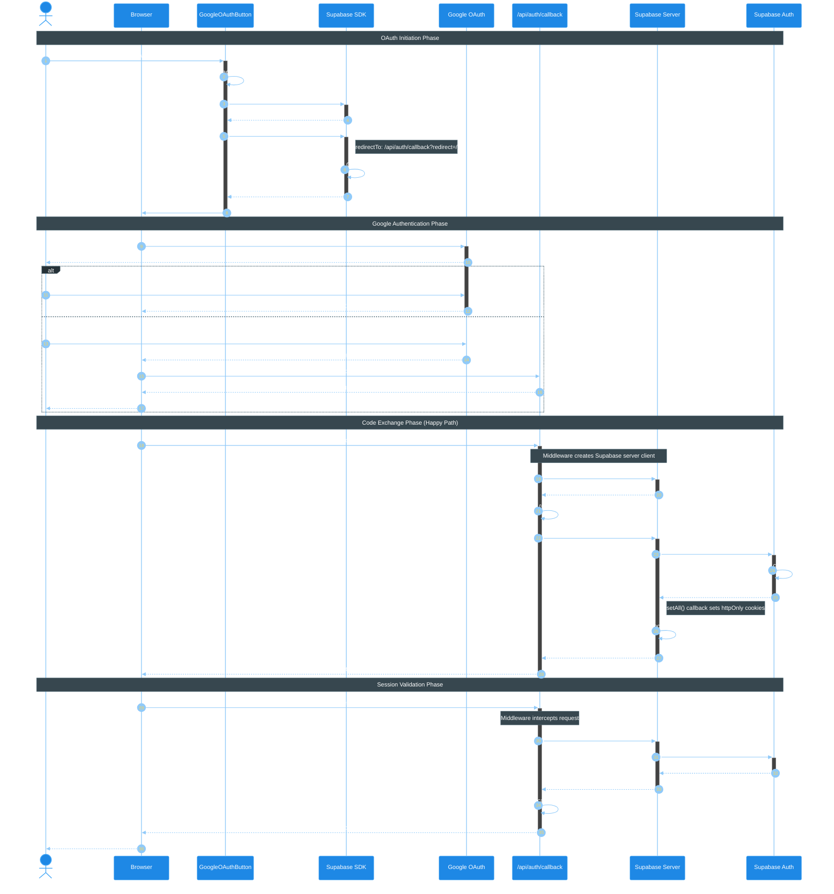

# Google OAuth Authentication Flow

This sequence diagram illustrates the complete Google OAuth authentication flow in the trip-planner application, from user initiation to authenticated session.

## Overview

The flow uses Supabase Auth with server-side rendering (SSR) via Astro. Key components:
- **GoogleOAuthButton** - React component initiating OAuth
- **Supabase SDK** - Client-side auth SDK (dynamically imported)
- **Google OAuth** - External identity provider
- **Callback API** - `/api/auth/callback` endpoint handling code exchange
- **Supabase Server** - Server-side client with httpOnly cookie management

## Sequence Diagram

<mermaid_diagram>



</mermaid_diagram>

## Key Implementation Details

### OAuth Initiation (`GoogleOAuthButton.tsx`)

```typescript
const { createClient } = await import("@supabase/supabase-js");
const supabase = createClient(supabaseUrl, supabaseKey);

await supabase.auth.signInWithOAuth({
  provider: "google",
  options: {
    redirectTo: `${window.location.origin}/api/auth/callback?redirect=${redirectTo}`,
  },
});
```

### Callback Handler (`/api/auth/callback.ts`)

```typescript
const code = url.searchParams.get("code");
const redirectTo = url.searchParams.get("redirect") ?? "/";

if (code) {
  const { error } = await supabase.auth.exchangeCodeForSession(code);
  if (error) {
    return redirect(`/login?error=${encodeURIComponent(error.message)}`);
  }
}

return redirect(redirectTo);
```

### Cookie Security (`supabase-server.ts`)

```typescript
export const cookieOptions: CookieOptionsWithName = {
  path: "/",
  secure: import.meta.env.PROD,  // HTTPS only in production
  httpOnly: true,                // Prevents XSS
  sameSite: "lax",              // CSRF protection
};
```

## Security Considerations

1. **httpOnly Cookies**: Session tokens are not accessible via JavaScript (XSS protection)
2. **Server-Side Validation**: `auth.getUser()` validates JWT with Supabase server (not just decoding)
3. **PKCE Flow**: Supabase uses PKCE (Proof Key for Code Exchange) for OAuth security
4. **SameSite Cookies**: `lax` setting provides CSRF protection while allowing OAuth redirects

## Error Scenarios

| Error | Trigger | User Experience |
|-------|---------|-----------------|
| User denies access | User clicks "Deny" on Google consent | Redirected to /login with error message |
| Code exchange fails | Invalid/expired code | Redirected to /login with error message |
| Network error | Connection issues | Loading state remains, console error logged |

## Related Files

- `src/components/auth/GoogleOAuthButton.tsx` - OAuth initiation component
- `src/pages/api/auth/callback.ts` - Code exchange endpoint
- `src/infrastructure/auth/supabase-server.ts` - Server client factory
- `src/middleware/index.ts` - Session validation middleware

