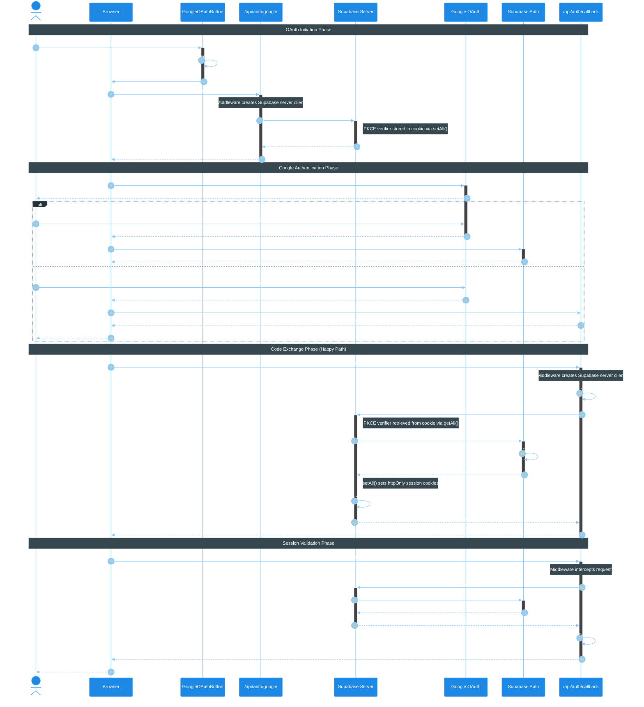

# Google OAuth Authentication Flow

This sequence diagram illustrates the complete Google OAuth authentication flow in the trip-planner application, from user initiation to authenticated session.

## Overview

The flow uses Supabase Auth with server-side rendering (SSR) via Astro. Key components:
- **GoogleOAuthButton** - React component that redirects to server OAuth endpoint
- **OAuth Endpoint** - `/api/auth/google` initiates OAuth with PKCE (verifier in cookie)
- **Google OAuth** - External identity provider
- **Callback Endpoint** - `/api/auth/callback` exchanges code for session
- **Supabase Server** - Server-side client with httpOnly cookie management

## Sequence Diagram

<mermaid_diagram>



</mermaid_diagram>

## Key Implementation Details

### OAuth Button (`GoogleOAuthButton.tsx`)

```typescript
const handleGoogleSignIn = () => {
  setIsLoading(true);
  // Redirect to server endpoint that initiates OAuth with proper PKCE
  window.location.href = `/api/auth/google?redirect=${encodeURIComponent(redirectTo)}`;
};
```

### Server OAuth Initiation (`/api/auth/google.ts`)

```typescript
export const GET: APIRoute = async ({ url, locals, redirect }) => {
  const { supabase } = locals;
  const redirectTo = url.searchParams.get("redirect") ?? "/";

  const { data, error } = await supabase.auth.signInWithOAuth({
    provider: "google",
    options: {
      redirectTo: `${url.origin}/api/auth/callback?redirect=${encodeURIComponent(redirectTo)}`,
    },
  });

  if (error || !data.url) {
    return redirect(`/login?error=${encodeURIComponent(error?.message ?? "OAuth failed")}`);
  }

  // PKCE verifier automatically stored in cookie by @supabase/ssr
  return redirect(data.url);
};
```

### Callback Handler (`/api/auth/callback.ts`)

```typescript
const code = url.searchParams.get("code");
const redirectTo = url.searchParams.get("redirect") ?? "/";

if (code) {
  // PKCE verifier automatically retrieved from cookie by @supabase/ssr
  const { error } = await supabase.auth.exchangeCodeForSession(code);
  if (error) {
    return redirect(`/login?error=${encodeURIComponent(error.message)}`);
  }
}

return redirect(redirectTo);
```

### Cookie Security (`supabase-server.ts`)

```typescript
export const cookieOptions: CookieOptionsWithName = {
  path: "/",
  secure: import.meta.env.PROD,  // HTTPS only in production
  httpOnly: true,                // Prevents XSS
  sameSite: "lax",              // CSRF protection
};
```

## Security Considerations

1. **Server-Side PKCE**: OAuth initiated server-side ensures PKCE verifier is stored in httpOnly cookies (not localStorage)
2. **httpOnly Cookies**: Session tokens and PKCE verifier are not accessible via JavaScript (XSS protection)
3. **Server-Side Validation**: `auth.getUser()` validates JWT with Supabase server (not just decoding)
4. **SameSite Cookies**: `lax` setting provides CSRF protection while allowing OAuth redirects

## Why Server-Side OAuth Initiation?

Per [Supabase PKCE documentation](https://supabase.com/docs/guides/auth/sessions/pkce-flow):
> "The code verifier is created and stored locally when the Auth flow is first initiated. That means the code exchange must be initiated on the same browser and device where the flow was started."

Client-side OAuth initiation stores the PKCE verifier in `localStorage`, but the server callback cannot access `localStorage`. By initiating OAuth server-side via `@supabase/ssr`, the verifier is stored in httpOnly cookies, making it accessible during server-side code exchange.

## Error Scenarios

| Error | Trigger | User Experience |
|-------|---------|-----------------|
| User denies access | User clicks "Deny" on Google consent | Redirected to /login with error message |
| Code exchange fails | Invalid/expired code or PKCE verifier | Redirected to /login with error message |
| OAuth initiation fails | Supabase configuration issue | Redirected to /login with error message |

## Related Files

- `src/components/auth/GoogleOAuthButton.tsx` - Redirects to server OAuth endpoint
- `src/pages/api/auth/google.ts` - Server-side OAuth initiation with PKCE
- `src/pages/api/auth/callback.ts` - Code exchange endpoint
- `src/infrastructure/auth/supabase-server.ts` - Server client factory with cookie handling
- `src/middleware/index.ts` - Session validation middleware
