# Authentication UI Architecture - Mermaid Diagram

This diagram visualizes the complete authentication UI architecture for the TripPlanner application, showing the flow from middleware through auth pages, protected pages, components, and state management.

## Architecture Overview

The authentication system is built with:
- **Astro 5** for SSR pages and routing
- **React 19** for interactive components
- **Supabase Auth** for authentication
- **Zustand** for client-side state management
- **Shadcn/ui** and **Vaul** for UI components

## Diagram

```mermaid
flowchart TD
    %% Middleware Layer
    MW[Middleware: Session Validation] -->|"Validates JWT via Supabase"| AUTH_CHECK{User Authenticated?}
    AUTH_CHECK -->|"Yes: Set Astro.locals.user"| PROTECTED_FLOW
    AUTH_CHECK -->|"No: Redirect to /login"| AUTH_PAGES

    %% Auth Pages Subgraph
    subgraph AUTH_PAGES["Authentication Pages (Astro SSR)"]
        direction TB
        LOGIN_PAGE["login.astro"]
        SIGNUP_PAGE["signup.astro"]
        RESET_PAGE["reset-password.astro"]
        UPDATE_PAGE["update-password.astro"]
        VERIFY_PAGE["verify-email.astro"]
        CALLBACK_PAGE["auth/callback.astro"]
    end

    %% Protected Pages Subgraph
    subgraph PROTECTED_PAGES["Protected Pages (Astro SSR)"]
        direction TB
        PLAN_PAGE["plan.astro"]
        MAP_PAGE["map.astro"]
    end

    PROTECTED_FLOW --> PROTECTED_PAGES

    %% Auth Form Components
    subgraph AUTH_FORMS["Auth Form Components (React client:load)"]
        direction TB
        LOGIN_FORM["LoginForm.tsx"]
        SIGNUP_FORM["SignupForm.tsx"]
        RESET_FORM["ResetPasswordForm.tsx"]
        UPDATE_FORM["UpdatePasswordForm.tsx"]
    end

    %% Auth Layout Components
    subgraph AUTH_LAYOUT["Auth Layout Utilities (Shared)"]
        direction TB
        AUTH_LAYOUT_COMP["AuthLayout.tsx"]
        AUTH_INPUT["AuthFormInput.tsx"]
        FORM_ERROR["FormErrorMessage.tsx"]
        PWD_STRENGTH["PasswordStrengthIndicator.tsx"]
    end

    %% Auth UI Components
    subgraph AUTH_UI["Auth UI Components"]
        direction TB
        GOOGLE_OAUTH["GoogleOAuthButton.tsx"]
        EMAIL_BANNER["EmailVerificationBanner.tsx"]
    end

    %% User Menu Components
    subgraph USER_MENUS["User Menu Components (Responsive)"]
        direction TB
        USER_DROPDOWN["UserMenuDropdown.tsx (Desktop)"]
        USER_DRAWER["UserMenuDrawer.tsx (Mobile)"]
    end

    %% Protected Page Components
    subgraph PROTECTED_COMPONENTS["Protected Page Components (React client:only)"]
        direction TB
        PLAN_COMPONENT["PlanPage.tsx"]
        MAP_COMPONENT["MapPlanner.tsx"]

        subgraph PLAN_LAYOUT["Plan Layouts"]
            PLAN_HEADER["PlanHeader.tsx"]
            PLAN_DESKTOP["DesktopLayout.tsx"]
            PLAN_MOBILE["MobileLayout.tsx"]
        end

        subgraph MAP_LAYOUT["Map Layouts"]
            MAP_DESKTOP["DesktopHeader.tsx"]
            MAP_MOBILE_HEADER["MobileHeader.tsx"]
        end
    end

    %% State Management
    subgraph STATE_MGMT["State Management (Zustand)"]
        direction TB
        AUTH_STORE["authStore.ts"]
        AUTH_TYPES["types.ts: AuthUser, AuthState"]
    end

    %% API Endpoints (Backend)
    subgraph API_ENDPOINTS["API Endpoints"]
        direction TB
        API_LOGIN["/api/auth/login"]
        API_SIGNUP["/api/auth/signup"]
        API_LOGOUT["/api/auth/logout"]
        API_RESET["/api/auth/reset-password"]
        API_UPDATE["/api/auth/update-password"]
        API_RESEND["/api/auth/resend-verification"]
    end

    %% Page to Component Connections
    LOGIN_PAGE -->|"Renders with user props"| LOGIN_FORM
    SIGNUP_PAGE -->|"Renders with user props"| SIGNUP_FORM
    RESET_PAGE -->|"Renders with user props"| RESET_FORM
    UPDATE_PAGE -->|"Renders with user props"| UPDATE_FORM

    %% Form to Layout Component Usage
    LOGIN_FORM -.->|"Uses"| AUTH_LAYOUT_COMP
    LOGIN_FORM -.->|"Uses"| AUTH_INPUT
    LOGIN_FORM -.->|"Uses"| FORM_ERROR
    LOGIN_FORM -.->|"Uses"| GOOGLE_OAUTH

    SIGNUP_FORM -.->|"Uses"| AUTH_LAYOUT_COMP
    SIGNUP_FORM -.->|"Uses"| AUTH_INPUT
    SIGNUP_FORM -.->|"Uses"| FORM_ERROR
    SIGNUP_FORM -.->|"Uses"| PWD_STRENGTH
    SIGNUP_FORM -.->|"Uses"| GOOGLE_OAUTH

    RESET_FORM -.->|"Uses"| AUTH_LAYOUT_COMP
    RESET_FORM -.->|"Uses"| AUTH_INPUT
    RESET_FORM -.->|"Uses"| FORM_ERROR

    UPDATE_FORM -.->|"Uses"| AUTH_LAYOUT_COMP
    UPDATE_FORM -.->|"Uses"| AUTH_INPUT
    UPDATE_FORM -.->|"Uses"| FORM_ERROR
    UPDATE_FORM -.->|"Uses"| PWD_STRENGTH

    %% Form to API Connections
    LOGIN_FORM -->|"POST"| API_LOGIN
    SIGNUP_FORM -->|"POST"| API_SIGNUP
    RESET_FORM -->|"POST"| API_RESET
    UPDATE_FORM -->|"POST"| API_UPDATE
    EMAIL_BANNER -->|"POST"| API_RESEND

    %% OAuth Flow
    GOOGLE_OAUTH -->|"Redirects to Supabase OAuth"| CALLBACK_PAGE
    CALLBACK_PAGE -->|"Exchanges code for session"| PROTECTED_PAGES

    %% Protected Page Connections
    PLAN_PAGE -->|"Passes user prop"| PLAN_COMPONENT
    MAP_PAGE -->|"Passes user prop"| MAP_COMPONENT

    PLAN_COMPONENT -->|"Initializes on mount"| AUTH_STORE
    MAP_COMPONENT -->|"Initializes on mount"| AUTH_STORE

    %% Layout Usage
    PLAN_COMPONENT -.->|"Renders"| PLAN_HEADER
    PLAN_COMPONENT -.->|"Renders"| PLAN_DESKTOP
    PLAN_COMPONENT -.->|"Renders"| PLAN_MOBILE

    MAP_COMPONENT -.->|"Renders"| MAP_DESKTOP
    MAP_COMPONENT -.->|"Renders"| MAP_MOBILE_HEADER

    %% User Menu Integration
    PLAN_HEADER -.->|"Displays"| USER_DROPDOWN
    PLAN_MOBILE -.->|"Displays"| USER_DRAWER
    MAP_DESKTOP -.->|"Displays"| USER_DROPDOWN
    MAP_MOBILE_HEADER -.->|"Displays"| USER_DRAWER

    %% User Menu Actions
    USER_DROPDOWN -->|"Calls logout"| API_LOGOUT
    USER_DRAWER -->|"Calls logout"| API_LOGOUT

    %% Auth Store Usage
    USER_DROPDOWN -.->|"Reads state"| AUTH_STORE
    USER_DRAWER -.->|"Reads state"| AUTH_STORE
    EMAIL_BANNER -.->|"Reads/Updates"| AUTH_STORE

    %% Verification Banner Display
    PLAN_COMPONENT -.->|"Conditionally renders"| EMAIL_BANNER
    MAP_COMPONENT -.->|"Conditionally renders"| EMAIL_BANNER

    %% Store Type Definitions
    AUTH_STORE -.->|"Uses types from"| AUTH_TYPES

    %% Logout Flow
    API_LOGOUT -->|"Clears session"| MW

    %% Styling Legend
    classDef authPage fill:#3b82f6,stroke:#1e40af,stroke-width:2px,color:#fff
    classDef protectedPage fill:#10b981,stroke:#059669,stroke-width:2px,color:#fff
    classDef formComponent fill:#f59e0b,stroke:#d97706,stroke-width:2px,color:#fff
    classDef layoutComponent fill:#8b5cf6,stroke:#7c3aed,stroke-width:2px,color:#fff
    classDef uiComponent fill:#ec4899,stroke:#db2777,stroke-width:2px,color:#fff
    classDef stateComponent fill:#ef4444,stroke:#dc2626,stroke-width:2px,color:#fff
    classDef apiEndpoint fill:#6366f1,stroke:#4f46e5,stroke-width:2px,color:#fff

    class LOGIN_PAGE,SIGNUP_PAGE,RESET_PAGE,UPDATE_PAGE,VERIFY_PAGE,CALLBACK_PAGE authPage
    class PLAN_PAGE,MAP_PAGE protectedPage
    class LOGIN_FORM,SIGNUP_FORM,RESET_FORM,UPDATE_FORM formComponent
    class AUTH_LAYOUT_COMP,AUTH_INPUT,FORM_ERROR,PWD_STRENGTH layoutComponent
    class GOOGLE_OAUTH,EMAIL_BANNER,USER_DROPDOWN,USER_DRAWER uiComponent
    class AUTH_STORE,AUTH_TYPES stateComponent
    class API_LOGIN,API_SIGNUP,API_LOGOUT,API_RESET,API_UPDATE,API_RESEND apiEndpoint
```



## Color Legend

- **Blue** - Authentication Pages (Astro SSR)
- **Green** - Protected Pages (Astro SSR)
- **Orange** - Form Components (React)
- **Purple** - Layout Utilities (Shared React Components)
- **Pink** - UI Components (OAuth, Banners, User Menus)
- **Red** - State Management (Zustand)
- **Indigo** - API Endpoints

## Arrow Types

- **Solid arrows (-->)** - Data flow and rendering relationships
- **Dotted arrows (-.->)** - Component usage and composition
- **Labeled arrows** - Specific actions (POST requests, redirects, etc.)

## Key Architecture Patterns

### 1. Middleware-First Security
- All requests pass through Astro middleware
- JWT validation via Supabase `auth.getUser()`
- Automatic redirect for unauthenticated users to `/login`
- User context set in `Astro.locals.user` for all downstream components

### 2. SSR to Client Hydration
- User data validated server-side (no client API call needed)
- Passed as props from Astro pages to React components
- Client store initialized on mount with server-provided data
- No loading states needed for authentication checks

### 3. Responsive Design
- **Desktop**: `UserMenuDropdown` component (shadcn/ui dropdown)
- **Mobile**: `UserMenuDrawer` component (Vaul drawer)
- Same functionality, optimized UX for each viewport
- Shared logic, different presentation

### 4. Shared Component Reuse
- All auth forms use the same layout utilities
- Consistent styling via `AuthLayout` wrapper
- Centralized validation with `AuthFormInput`
- DRY principle applied throughout

### 5. OAuth Integration
- `GoogleOAuthButton` initiates Supabase OAuth flow
- Redirects to Google for authorization
- `auth/callback.astro` handles code exchange
- Seamless integration with email/password flows

### 6. State Management
- Zustand store for client-side auth state
- Only persistence: `emailVerificationDismissed` (sessionStorage)
- User data comes from server SSR props (not stored client-side)
- Logout clears both server session and client state

## Component Directory Structure

```
src/
├── middleware/
│   └── index.ts                           # Session validation, route protection
├── pages/
│   ├── login.astro                        # Login page (SSR)
│   ├── signup.astro                       # Signup page (SSR)
│   ├── reset-password.astro               # Password reset request (SSR)
│   ├── update-password.astro              # Password update form (SSR)
│   ├── verify-email.astro                 # Email verification confirmation (SSR)
│   ├── plan.astro                         # Protected plan page (SSR)
│   ├── map.astro                          # Protected map page (SSR)
│   ├── auth/
│   │   └── callback.astro                 # OAuth callback handler (SSR)
│   └── api/auth/
│       ├── login.ts                       # Login endpoint
│       ├── signup.ts                      # Signup endpoint
│       ├── logout.ts                      # Logout endpoint
│       ├── reset-password.ts              # Password reset request
│       ├── update-password.ts             # Password update
│       └── resend-verification.ts         # Resend verification email
└── components/
    ├── auth/
    │   ├── LoginForm.tsx                  # Email/password login form
    │   ├── SignupForm.tsx                 # User registration form
    │   ├── ResetPasswordForm.tsx          # Password reset request form
    │   ├── UpdatePasswordForm.tsx         # Password update form
    │   ├── GoogleOAuthButton.tsx          # Google OAuth trigger
    │   ├── EmailVerificationBanner.tsx    # Verification reminder banner
    │   ├── layout/
    │   │   ├── AuthLayout.tsx             # Centered card wrapper
    │   │   ├── AuthFormInput.tsx          # Reusable input with error
    │   │   ├── FormErrorMessage.tsx       # Form-level error display
    │   │   └── PasswordStrengthIndicator.tsx  # Password requirements
    │   ├── user-menu/
    │   │   ├── UserMenuDropdown.tsx       # Desktop user menu
    │   │   └── UserMenuDrawer.tsx         # Mobile user menu
    │   └── stores/
    │       ├── authStore.ts               # Zustand auth store
    │       └── types.ts                   # Auth type definitions
    ├── plan/
    │   ├── PlanPage.tsx                   # Main plan page component
    │   └── layout/
    │       ├── PlanHeader.tsx             # Plan page header with user menu
    │       ├── DesktopLayout.tsx          # Plan desktop layout
    │       └── MobileLayout.tsx           # Plan mobile layout
    └── map/
        ├── MapPlanner.tsx                 # Main map page component
        ├── layouts/
        │   └── DesktopHeader.tsx          # Map desktop header with user menu
        └── mobile/
            └── MobileHeader.tsx           # Map mobile header with user menu
```

## Data Flow Sequence

### Initial Page Load (Protected Route)
1. User requests `/plan` or `/map`
2. Middleware validates JWT via Supabase
3. If authenticated: Set `Astro.locals.user` → Continue to page
4. If not authenticated: Redirect to `/login?redirect=/plan`
5. Astro page passes `user` prop to React component
6. React component hydrates and initializes auth store

### Login Flow
1. User fills email/password on `LoginForm`
2. Client validates with Zod schema
3. POST to `/api/auth/login`
4. API validates credentials via Supabase
5. Session cookie set (HTTP-only)
6. Redirect to protected page or home

### OAuth Flow
1. User clicks `GoogleOAuthButton`
2. Redirects to Google authorization
3. Google redirects back to `/auth/callback?code=...`
4. Callback page exchanges code for session
5. Session cookie set
6. Redirect to protected page or home

### Logout Flow
1. User clicks logout in user menu
2. `authStore.logout()` called
3. POST to `/api/auth/logout`
4. Server clears session cookies
5. Client clears auth store
6. Redirect to home page

## Implementation Notes

- All auth pages use `export const prerender = false` for SSR
- Middleware protects routes at the framework level (no client-side checks needed)
- No auth loading states required (middleware handles protection before render)
- User menus integrated seamlessly into existing plan/map layouts
- Email verification is optional and non-blocking for app access
- Forms use Zod for validation before API calls
- All components follow Tailwind styling with dark theme
- Responsive design uses viewport detection for desktop/mobile variants

## References

- [PRD](./../prd.md) - Product requirements document
- [Auth Implementation Plan](./../auth-implementation-plan.md) - Detailed auth specification
- [Middleware](../../src/middleware/index.ts) - Route protection implementation
- [Auth Components](../../src/components/auth/) - All auth React components
- [Auth Pages](../../src/pages/) - Astro SSR auth pages
