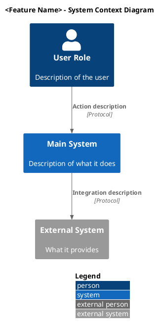
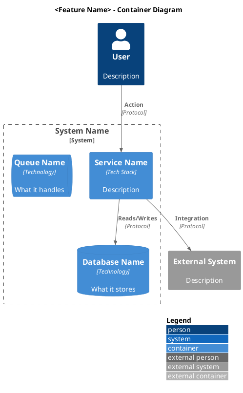
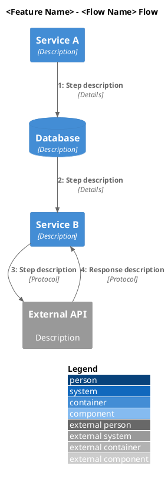

# C4 Architecture Diagrams Creation

Rules for creating C4 model architecture diagrams using PlantUML with the @C4-PlantUML library.

## Documentation Reference

- **ALWAYS consult** @C4-PlantUML for up-to-date syntax and features
- **C4 Model**: https://c4model.com/
- **C4-PlantUML Repository**: https://github.com/plantuml-stdlib/C4-PlantUML

## File Structure

- **Place diagrams in** `.cursor/diagrams/<feature-name>/c4/` directory
- **Use numbered prefixes** for diagram files to indicate hierarchy and reading order:
  - `1-context.puml` - System Context (Level 1)
  - `2-container.puml` - Container Diagram (Level 2)
  - `3-component.puml` - Component Diagram (Level 3)
  - `4-dynamic-<flow-name>.puml` - Dynamic flow diagrams
- **Include a README.md** explaining each diagram's purpose

## Include Statements

Use the PlantUML standard library includes (requires PlantUML >= 1.2021.6):

```plantuml
' For Context diagrams
!include <C4/C4_Context>

' For Container diagrams
!include <C4/C4_Container>

' For Component diagrams
!include <C4/C4_Component>

' For Dynamic diagrams
!include <C4/C4_Dynamic>

' For Deployment diagrams
!include <C4/C4_Deployment>
```

**Alternative**: Use versioned URLs for specific C4-PlantUML versions:

```plantuml
!include https://raw.githubusercontent.com/plantuml-stdlib/C4-PlantUML/v2.9.0/C4_Container.puml
```

## Diagram Types and When to Use

- **Context Diagram (Level 1)** - High-level view showing system and external dependencies
  - Use for: Overview of the system, external actors, and integrated systems
  - Elements: `Person()`, `Person_Ext()`, `System()`, `System_Ext()`

- **Container Diagram (Level 2)** - Internal architecture showing services and databases
  - Use for: Showing major containers within the system boundary
  - Elements: `Container()`, `ContainerDb()`, `ContainerQueue()`, `System_Boundary()`

- **Component Diagram (Level 3)** - Internal components of a specific container
  - Use for: Detailed view of a service's internal structure
  - Elements: `Component()`, `ComponentDb()`, `ComponentQueue()`, `Container_Boundary()`

- **Dynamic Diagram** - Runtime flow showing numbered sequence of interactions
  - Use for: Showing step-by-step flows, request handling, event processing
  - Uses `C4_Dynamic` which automatically numbers relationships

## PlantUML Templates

### Context Diagram Template



### Container Diagram Template



### Dynamic Diagram Template



## C4-PlantUML Element Reference

### Persons

- `Person(alias, "Label", "Description")` - Internal user
- `Person_Ext(alias, "Label", "Description")` - External user

### Systems

- `System(alias, "Label", "Description")` - Internal system
- `System_Ext(alias, "Label", "Description")` - External system
- `System_Boundary(alias, "Label")` - System boundary container

### Containers

- `Container(alias, "Label", "Technology", "Description")` - Generic container
- `ContainerDb(alias, "Label", "Technology", "Description")` - Database
- `ContainerQueue(alias, "Label", "Technology", "Description")` - Message queue
- `Container_Boundary(alias, "Label")` - Container boundary

### Components

- `Component(alias, "Label", "Technology", "Description")` - Generic component
- `ComponentDb(alias, "Label", "Technology", "Description")` - Database component
- `ComponentQueue(alias, "Label", "Technology", "Description")` - Queue component

### Relationships

- `Rel(from, to, "Label", "Technology")` - Standard relationship
- `Rel_Back(from, to, "Label", "Technology")` - Reverse direction
- `Rel_U(from, to, "Label", "Technology")` - Upward
- `Rel_D(from, to, "Label", "Technology")` - Downward
- `Rel_L(from, to, "Label", "Technology")` - Leftward
- `Rel_R(from, to, "Label", "Technology")` - Rightward

### Layout

- `LAYOUT_WITH_LEGEND()` - Includes legend in diagram
- `LAYOUT_LEFT_RIGHT()` - Horizontal layout
- `LAYOUT_TOP_DOWN()` - Vertical layout (default)
- `SHOW_LEGEND()` - Shows legend at end

## Naming Conventions

- **Diagram name** in `@startuml`: Use PascalCase with underscores, e.g., `CAST_Dynamic_Account_Provisioning`
- **Element aliases**: Use camelCase, e.g., `customerMonitor`, `mainDb`, `cqgApi`
- **Labels**: Use proper capitalization and spaces, e.g., `"Customer Monitor Service"`
- **File names**: Use kebab-case with number prefix, e.g., `4-dynamic-account-provisioning.puml`

## Content Guidelines

- **Keep descriptions concise** - One line descriptions for elements
- **Use consistent terminology** - Match terms used in the codebase
- **Show relevant relationships only** - Don't clutter with every possible connection
- **Include technology stack** - Specify languages, frameworks, protocols
- **Use proper C4 abstractions** - Don't mix levels inappropriately

## Relationship Labels

- **Format**: `Rel(from, to, "Action description", "Protocol/Technology")`
- **Action descriptions** should be verb-based: "Creates", "Reads/Writes", "Triggers", "Subscribes to"
- **Protocol/Technology** examples: "HTTPS", "WebSocket", "JDBC", "Pekko Messages", "Event Bus"

## Optional Features (from @C4-PlantUML)

### Sprites/Icons

```plantuml
!define DEVICONS https://raw.githubusercontent.com/tupadr3/plantuml-icon-font-sprites/master/devicons
!include DEVICONS/java.puml

Container(api, "API", "java", "Handles business logic", $sprite="java")
```

### Custom Tags

```plantuml
AddElementTag("deprecated", $bgColor="#gray")
Container(oldService, "Legacy Service", "Java", "Deprecated", $tags="deprecated")
```

## Quality Checklist

Before finalizing diagrams, verify:

- [ ] Correct C4 include statement for diagram type
- [ ] `LAYOUT_WITH_LEGEND()` included for proper rendering
- [ ] Meaningful title describing the diagram
- [ ] All element aliases are unique
- [ ] Relationships have both action and protocol
- [ ] No orphaned elements without relationships
- [ ] Consistent naming with codebase terminology
- [ ] README.md documents all diagrams

## Example Diagrams

See example implementation: `@.cursor/diagrams/cast/c4/`
